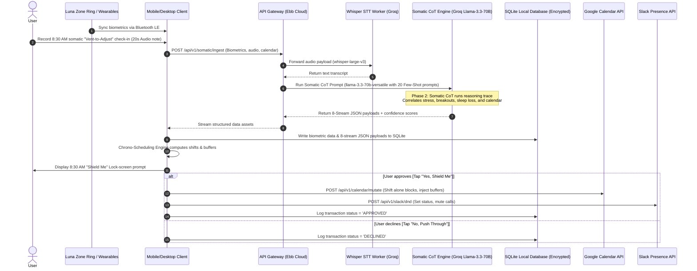

# Technical Architecture & Systems Design: Ebb

This document outlines the target production system architecture, 4-phase Ingestion Pipeline, API flows, database schemas, and JSON payload structures for **Ebb: The Unified Somatic & Energy Operating System**.

---

## 1. System Topology & Data Flow

Ebb utilizes a local-first hybrid topology. To protect user privacy, biometric data caching and decision logs are stored in a local SQLite database using strong encryption (payload/column-level AES-256-GCM with keys derived via Scrypt, or SQLCipher). Cloud services are utilized statelessly for resource-intensive operations: Whisper Speech-to-Text transcription and LLM-based structured entity extraction via the high-performance Groq API (using `whisper-large-v3` and `llama-3.3-70b-versatile`), and calendar syncing.



---

## 2. The 4-Phase Somatic Chain-of-Thought (CoT) Ingestion Pipeline

To process messy, multi-modal human realities (voice check-ins, sleep telemetry, calendar meetings) into structured data, Ebb implements a 4-Phase Somatic CoT pipeline based on a specialized reasoning framework.

```
       INPUT DATA                             COT PROCESSOR                           OUTPUT LAYER
┌──────────────────────┐               ┌──────────────────────────┐               ┌───────────────────┐
│ • Audio Check-In     │               │ Phase 1: Context Seeding  │               │                   │
│ • Wearable Sleep/HRV │               │  (20 Few-shot prompts)   │               │ 8 somatic ledger  │
│ • Keystroke Density  │ ────────────> ├──────────────────────────┤ ────────────> │ JSON payloads     │
│ • Calendar Metadata  │               │ Phase 2: Reasoning Trace │               │ with confidence   │
└──────────────────────┘               │  (Anatomy/stress logs)   │               │ scores            │
                                       └──────────────────────────┘               └───────────────────┘
```

### Phase 1: Input & Ingestion (The Foundation)
*   **Data Aggregation**: Ingests raw voice check-ins—like Anya's 20-second "Vent-to-Adjust" check-in (e.g., *"waking breakouts, hair shedding, nauseous during Peloton"*), wearable biometrics (overnight sleep stages, waking HRV, heart rate curves), and active calendar metadata (attendee lists, event titles).
*   **Prompt Seeding**: The engine loads the ingestion payload and seeds it with **20 gold-standard few-shot prompts**. These prompts contain annotated voice-to-somatic mappings, ensuring the parser handles technical terminology, symptoms (e.g. hair-thinning, cystic breakouts), and calendar boundaries with precision.

### Phase 2: Somatic Chain-of-Thought Engine
*   **Reasoning Trace**: The LLM engine does not perform direct parsing. It generates a step-by-step reasoning trace:
    1.  *Biometric Alignment*: Evaluates subjective claims ("I feel fine") against objective biometrics (HRV 24ms, sleep 5.2 hours) to determine true physiological capacity.
    2.  *Root Cause Diagnosis*: Resolves symptoms across physiological lag times. For instance, it correlates Anya's current somatic hair shedding (telogen effluvium) with stressful calendar blocks and high-cortisol periods logged 90 days prior.
    3.  *Urgency Classification*: Detects active physical red-lines (e.g. thyroid sluggishness, high resting heart rate) that dictate immediate schedule reduction.
*   **Extracting Output Entities**: Defines the bounds and confidence scores for each of the 8 dimensions.

### Phase 3: Structured Data Asset Creation & Confidence Gate
*   **JSON Generation**: The outputs are parsed into the 8 standardized dimensions detailed in Section 4.
*   **Log-Probability Evaluation**: The confidence scores are derived directly from the average token log-probabilities output by the local LLM during parsing of the voice transcripts.
*   **The 0.75 Quality Gate**: If any dimension's confidence score falls **below 0.75**, Ebb blocks the silent database write. Instead, it triggers a confirmation alert in the client application, requiring Anya to edit or verify the data in her desktop client before final database commit.

### Phase 4: Roll-up & Chrono-Scheduling Action
*   **Metrics Synthesis**: Computes the daily Cognitive Alignment Score (CAS).
*   **Calendar Shifts**: Feeds the proposed calendar shifts to the "Shield Me" decision queue.
*   **API Execution**: Executes Google Calendar writes and Slack status mutations upon receiving user approval.

---

## 3. Database Schema Definitions (SQLite Encrypted)

Ebb runs a local-first SQLite instance encrypted at rest using payload/column-level AES-256-GCM (with keys derived via Scrypt) or SQLCipher. We store minimal, highly structured representations of Anya's day.

```sql
-- 1. USER PROFILES
CREATE TABLE user_profiles (
    id TEXT PRIMARY KEY,
    email TEXT NOT NULL UNIQUE,
    oauth_google_cal TEXT NOT NULL, -- Encrypted Google Calendar tokens
    oauth_wearable_token TEXT,      -- Encrypted wearable API tokens
    baseline_hrv INTEGER DEFAULT 70,
    created_at TEXT DEFAULT CURRENT_TIMESTAMP
);

-- 2. DAILY BIOMETRICS LOG
CREATE TABLE biometrics_log (
    id TEXT PRIMARY KEY,
    user_id TEXT,
    date TEXT NOT NULL UNIQUE,
    sleep_duration_seconds INTEGER NOT NULL,
    resting_heart_rate INTEGER NOT NULL,
    hrv_ms INTEGER NOT NULL,
    subjective_alertness_rating INTEGER, -- 1-5 fallback slider
    calculated_battery_percentage INTEGER NOT NULL,
    FOREIGN KEY(user_id) REFERENCES user_profiles(id)
);

-- 3. CALENDAR CACHE
CREATE TABLE calendar_cache (
    id TEXT PRIMARY KEY,
    user_id TEXT,
    event_id TEXT NOT NULL UNIQUE,
    event_title TEXT NOT NULL,
    start_time TEXT NOT NULL,
    end_time TEXT NOT NULL,
    attendee_count INTEGER DEFAULT 1,
    is_external INTEGER DEFAULT 0, -- 0 = false, 1 = true
    classification TEXT NOT NULL,   -- 'LOCKED' or 'RESCHEDULABLE'
    FOREIGN KEY(user_id) REFERENCES user_profiles(id)
);

-- 4. SOMATIC SHIFTS LOG
CREATE TABLE somatic_shifts_log (
    id TEXT PRIMARY KEY,
    user_id TEXT,
    date TEXT NOT NULL,
    proposed_shifts_json TEXT NOT NULL, -- Detailed event movements proposed
    user_decision TEXT NOT NULL,        -- 'PENDING', 'APPROVED', 'DECLINED'
    cognitive_alignment_score INTEGER NOT NULL,
    created_at TEXT DEFAULT CURRENT_TIMESTAMP,
    FOREIGN KEY(user_id) REFERENCES user_profiles(id)
);

-- 5. SOMATIC DIMENSIONS LOG (8-Stream Ledger)
CREATE TABLE somatic_dimensions_log (
    id TEXT PRIMARY KEY,
    user_id TEXT,
    date TEXT NOT NULL,
    dimension_name TEXT NOT NULL,       -- 'NUTRITION', 'MENTAL_HEALTH', etc.
    payload_json TEXT NOT NULL,          -- JSON payload representing the dimension data (encrypted at rest)
    confidence_score REAL NOT NULL,      -- CoT extraction confidence score (0.0 to 1.0)
    device_source TEXT,                 -- 'Luna Ring', 'Oura Cloud', 'Manual Slider', 'Whisper STT'
    updated_at TEXT DEFAULT CURRENT_TIMESTAMP,
    FOREIGN KEY(user_id) REFERENCES user_profiles(id),
    UNIQUE(user_id, date, dimension_name)
);

CREATE INDEX idx_somatic_dim_date ON somatic_dimensions_log(user_id, date);
CREATE INDEX idx_calendar_time ON calendar_cache(start_time, end_time);
```

---

## 4. Detailed 8-Stream JSON Schemas & Payloads

The database stores the 8 lifestyle and physical dimensions inside `somatic_dimensions_log.payload_json`. Below are the concrete schemas and example JSON structures.

### Dimension 1: Nutritional Needs (`NUTRITION`)
```json
{
  "timestamp": "2026-05-30T08:30:00Z",
  "nutrients": {
    "calories_target": 2400,
    "calories_consumed": 1850,
    "protein_grams": 140,
    "carbs_grams": 180,
    "fat_grams": 65,
    "water_liters": 2.2
  },
  "micronutrients": {
    "zinc_mg": 15,
    "iron_mg": 18,
    "selenium_mcg": 55
  },
  "supportive_flags": {
    "supports_hair_follicle_strength": true,
    "supports_thyroid_stability": true
  },
  "somatic_indicators": {
    "gut_health_score": 4.0,
    "bloating_level": "low"
  },
  "confidence_metrics": {
    "calories_log_precision": 0.85,
    "water_sync_status": "synced"
  }
}
```

### Dimension 2: Mental Health State (`MENTAL_HEALTH`)
```json
{
  "timestamp": "2026-05-30T08:30:00Z",
  "cognitive_load": {
    "focus_capacity": "moderate",
    "burnout_risk_index": 0.65,
    "brain_fog_level": "medium"
  },
  "psychological_state": {
    "subjective_anxiety_score": 3,
    "stress_resilience_hrv_ms": 24,
    "mood_valence": "neutral_anxious",
    "mood_sentiment": "anxious_underpressure"
  },
  "symptom_array": [
    "cystic_acne",
    "heavy_legs"
  ],
  "sleep_metrics": {
    "sleep_quality_score": 58,
    "rem_duration_seconds": 3200,
    "deep_duration_seconds": 2400,
    "latency_seconds": 1800
  },
  "confidence_metrics": {
    "subjective_confidence": 0.90,
    "biometric_correlation": 0.82
  }
}
```

### Dimension 3: Active & Activity Hours (`ACTIVITY`)
```json
{
  "timestamp": "2026-05-30T08:30:00Z",
  "exercise": {
    "workout_type": "somatic_walk",
    "duration_minutes": 30,
    "intensity": "low",
    "calories_burned": 150
  },
  "daily_movement": {
    "steps": 4500,
    "stand_hours": 6,
    "active_minutes": 45,
    "cardio_load": 0.2
  },
  "scheduled_workout_intents": [
    {
      "type": "swimming",
      "target_duration_minutes": 45,
      "intensity_target": "moderate"
    }
  ],
  "fatigue_profile": {
    "physical_exhaustion_score": 7,
    "recovery_duration_required_minutes": 90
  },
  "confidence_metrics": {
    "wearable_sensor_reliability": 0.95,
    "activity_classification_confidence": 0.88
  }
}
```

### Dimension 4: Physique & Aesthetic (`SOMATIC_AESTHETIC` / `PHYSIQUE`)
```json
{
  "timestamp": "2026-05-30T08:30:00Z",
  "composition": {
    "weight_kg": 62.5,
    "body_fat_percentage": 21.4,
    "lean_mass_kg": 49.1,
    "skeletal_muscle_mass_kg": 25.2
  },
  "aesthetic_symptom_map": {
    "hair_strand_loss_count": 120,
    "breakout_severity": "moderate",
    "breakout_location": "jawline_hormonal",
    "scalp_dryness_index": 3,
    "sebum_level": "high"
  },
  "stress_lag_analysis": {
    "90_day_lag_correlation_index": 0.85,
    "current_telogen_effluvium_risk": "elevated",
    "resting_compliance_required": true
  },
  "recovery": {
    "muscle_soreness_index": 4.0,
    "joint_strain_level": "none",
    "readiness_score": 45
  },
  "confidence_metrics": {
    "scale_sync_status": "synced",
    "metric_precision": 0.90
  }
}
```

### Dimension 5: Work Performance (`WORK`)
```json
{
  "timestamp": "2026-05-30T08:30:00Z",
  "target_alone_focus_tasks": [
    {
      "task_title": "Security Spec Drafting",
      "complexity_tag": "HIGH",
      "target_duration_seconds": 7200,
      "original_start": "2026-05-30T14:00:00Z",
      "status": "RESCHEDULABLE"
    },
    {
      "task_title": "Backlog Triage",
      "complexity_tag": "LOW",
      "target_duration_seconds": 3600,
      "original_start": "2026-05-30T16:00:00Z",
      "status": "RESCHEDULABLE"
    }
  ],
  "productivity_metrics": {
    "deep_work_seconds_allocated": 10800,
    "deep_work_seconds_actual": 3600,
    "slack_triage_duration_seconds": 7200,
    "meeting_duration_seconds": 14400,
    "focus_interruptions_count": 14
  },
  "confidence_metrics": {
    "telemetry_log_completeness": 0.90,
    "calendar_overlap_resolved": true
  }
}
```

### Dimension 6: Friends & Family (Social Connection) (`SOCIAL`)
```json
{
  "timestamp": "2026-05-30T08:30:00Z",
  "connection_intents": [
    {
      "relationship_type": "family",
      "contact_method": "call",
      "target_contact_name": "Mom",
      "relationship_status": "active"
    }
  ],
  "interactions": [
    {
      "relationship_type": "team",
      "contact_method": "meeting",
      "duration_minutes": 60,
      "energy_exchange": "draining"
    }
  ],
  "social_wellbeing": {
    "subjective_loneliness_score": 2,
    "social_battery_percentage": 30,
    "relationship_maintenance_index": 0.75
  },
  "confidence_metrics": {
    "interaction_log_completeness": 0.80,
    "sensor_proximity_confidence": 0.70
  }
}
```

### Dimension 7: Creative Block Management (`CREATIVE`)
```json
{
  "timestamp": "2026-05-30T08:30:00Z",
  "creative_blocks": [
    {
      "focus_area": "Independent LLM Quantization Research",
      "target_duration_minutes": 60,
      "unstructured_thinking_duration_minutes": 15,
      "flow_state_achieved": false
    }
  ],
  "confidence_metrics": {
    "self_report_reliability": 0.88,
    "app_usage_downtime_verified": true
  }
}
```

### Dimension 8: Self-Care & Somatic routines (`SELF_CARE`)
```json
{
  "timestamp": "2026-05-30T08:30:00Z",
  "routine_details": {
    "hair_care_routine_completed": true,
    "skin_care_routine_completed": true,
    "skincare_acne_treatment_applied": true,
    "meditation_duration_minutes": 10
  },
  "somatic_walks": [
    {
      "type": "Somatic Recovery Walk",
      "duration_minutes": 25,
      "screen_free_compliance": true
    }
  ],
  "mental_restoration_index": 0.35,
  "confidence_metrics": {
    "routine_log_precision": 0.92
  }
}
```

---

## 5. API Flow Design

Below are the primary HTTP API endpoint definitions for backend communication.

### Ingest Somatic Session
*   **Endpoint**: `POST /api/v1/somatic/ingest`
*   **Description**: Ingests raw sleep metrics, steps telemetry, and voice recording file. Triggers Whisper transcription and Somatic CoT parse execution.
*   **Request Body Parameters**:
    *   `audio_checkin`: Binary voice file (ogg/mp4 format)
    *   `wearable_sleep_seconds`: Integer (seconds)
    *   `wearable_hrv_ms`: Integer (ms)
    *   `keystroke_density_raw`: String (JSON of keyboard/mouse actions)
*   **Success Response** (`200 OK`):
    ```json
    {
      "date": "2026-05-30",
      "somatic_battery_percentage": 45,
      "transcript": "Woke up at 7:30 feeling exhausted. Heavy fatigue, skin breaking out.",
      "dimensions_extracted": [
        { "name": "MENTAL_HEALTH", "confidence": 0.92 },
        { "name": "SOMATIC_AESTHETIC", "confidence": 0.88 },
        { "name": "NUTRITION", "confidence": 0.78 }
      ],
      "actions_queued": true
    }
    ```

### Generate Calendar Shield Proposal
*   **Endpoint**: `POST /api/v1/calendar/shield-proposal`
*   **Description**: Analyzes active Google Calendar configuration and returns proposed shifting actions and buffer injections.
*   **Success Response** (`200 OK`):
    ```json
    {
      "somatic_battery": 45,
      "cas_projection_standard": 35,
      "cas_projection_shielded": 85,
      "proposed_actions": [
        {
          "type": "SHIFT_EVENT",
          "event_id": "evt_spec_writing_123",
          "title": "Security Spec Drafting",
          "original_start": "2026-05-30T14:00:00Z",
          "proposed_start": "2026-05-31T09:00:00Z"
        },
        {
          "type": "INJECT_BUFFER",
          "after_event_id": "evt_arch_review_456",
          "title": "Zero-Stimulus Recovery Buffer",
          "start": "2026-05-30T11:00:00Z",
          "end": "2026-05-30T11:30:00Z"
        }
      ]
    }
    ```

### Confirm Shield Modifications
*   **Endpoint**: `POST /api/v1/calendar/shield-confirm`
*   **Description**: Mutates Google Calendar to commit the proposed changes and signals Slack presence API status changes.
*   **Success Response** (`200 OK`):
    ```json
    {
      "status": "MUTATION_COMPLETE",
      "google_cal_sync_token": "gcal_sync_tok_789",
      "slack_dnd_active": true
    }
    ```

### Re-build Schedule of the Day (Mid-Day Reset)
*   **Endpoint**: `POST /api/v1/calendar/rebuild`
*   **Description**: Invoked mid-day when real-time biometric indicators drop below active threshold tolerances. Recalculates remaining afternoon capacity and shifts flexible tasks to tomorrow.
*   **Request Body**:
    ```json
    {
      "current_time": "2026-05-30T13:00:00Z",
      "triggered_by": "REAL_TIME_HRV_DIP",
      "somatic_battery_current": 20
    }
    ```
*   **Success Response** (`200 OK`):
    ```json
    {
      "rebuild_executed": true,
      "shifted_events": [
        {
          "event_id": "evt_backlog_triage_889",
          "title": "Backlog Triage",
          "original_start": "2026-05-30T15:30:00Z",
          "new_start": "2026-05-31T14:00:00Z"
        }
      ],
      "injected_buffers": [
        {
          "title": "Emergency Somatic Decompression",
          "start": "2026-05-30T13:30:00Z",
          "end": "2026-05-30T14:00:00Z"
        }
      ]
    }
    ```

---

## 6. Chrono-Scheduling Engine Design

The **Chrono-Scheduling Engine** manages Anya's calendar layouts, applying rules to handle locked multiplayer reviews and reschedulable alone blocks.

### Scheduling Algorithms:
1.  **Multiplayer Classifier**:
    For every calendar item, the system scans the attendee array:
    $$\text{Status} = \begin{cases} \text{LOCKED} & \text{if } |\text{Attendees}| \ge 3 \text{ or } \text{ContainsExternalDomain}(\text{Attendees}) \\ \text{RESCHEDULABLE} & \text{otherwise} \end{cases}$$
2.  **Somatic Rescheduler**:
    On low-recovery days (HRV $< 30$ms or thyroid slumps), Ebb reads the `RESCHEDULABLE` list (e.g. *Security Spec Drafting*). It identifies the compressed peak hour (waking hour + 1.5 hours) and shifts these blocks there.
3.  **Active Recovery Buffer Injection**:
    For every `LOCKED` event meeting (e.g. 10:00 AM Architecture Review) occurring during a low-HRV trough, Ebb reads the meeting end timestamp and inserts a `SELF_CARE` record (e.g. 20-minute somatic reset window) on her Google Calendar. During this window, the Slack API is called to set her status to *"Offline (Ebb Buffer)"* and auto-decline incoming calls.

### Engine Logic (Including Mid-Day Re-build)
```python
def reschedule_somatic_day(user_biometrics, calendar_events, current_time=None):
    # Calculate energy score baseline
    energy_score = calculate_somatic_battery(user_biometrics)
    is_low_energy = energy_score < 45
    
    # Classify meetings
    locked_meetings = []
    alone_sessions = []
    
    for event in calendar_events:
        # Filter past meetings if doing a mid-day rebuild
        if current_time and event.end_time <= current_time:
            continue
            
        if len(event.attendees) >= 3 or event.is_external:
            event.status = "LOCKED"
            locked_meetings.append(event)
        else:
            event.status = "RESCHEDULABLE"
            alone_sessions.append(event)
            
    if is_low_energy:
        # If mid-day reset is triggered, execute structural decompression
        if current_time:
            execute_midday_rebuild_shift(alone_sessions, locked_meetings, current_time)
            return
            
        # Standard Morning Planning Flow
        peak_window = find_biological_peak_window(user_biometrics) # e.g. 9:00 - 10:00 AM
        for session in alone_sessions:
            if session.type == "focus":
                session.start = peak_window.start
                session.end = peak_window.start + timedelta(minutes=60) # Compress to 1 hour
                session.status = "PROTECTED"
                
        for meeting in locked_meetings:
            if meeting.cognitive_load == "HIGH":
                buffer_start = meeting.end
                buffer_end = meeting.end + timedelta(minutes=30)
                recovery_block = Event(
                    title="Zero-Stimulus Buffer",
                    start=buffer_start,
                    end=buffer_end,
                    type="recovery"
                )
                alone_sessions.append(recovery_block)
                
        slump_window = find_biological_slump_window(user_biometrics) # e.g. 2:00 - 4:00 PM
        for session in alone_sessions:
            if session.type == "admin":
                session.start = slump_window.start + timedelta(minutes=30)
                session.status = "SHIFTED"

def execute_midday_rebuild_shift(alone_sessions, locked_meetings, current_time):
    # Shift all remaining alone focus sessions to tomorrow morning
    for session in alone_sessions:
        if session.status == "RESCHEDULABLE" and session.start_time > current_time:
            session.start_time = session.start_time + timedelta(days=1)
            session.status = "MIDDAY_REBUILT"
            
    # Inject immediate 30-minute block after current_time
    decompression_block = Event(
        title="Emergency Somatic Decompression",
        start=current_time,
        end=current_time + timedelta(minutes=30),
        type="recovery"
    )
    alone_sessions.append(decompression_block)
```

---

## 7. Chrono-Scheduling Alert Thresholds & Engine Logic

Ebb resolves threshold events dynamically through a database listener and local wearable data push triggers.

```python
def check_somatic_alerts(biometrics, dimensions_log, db_conn):
    # 1. Readiness Threshold Alert (Sleep/HRV combination)
    readiness_percentage = calculate_somatic_battery(biometrics)
    if readiness_percentage < 45:
        dispatch_somatic_shield_alert(biometrics.user_id, readiness_percentage)

    # 2. Real-Time HRV Depletion Threshold (Mid-Day reset check)
    current_hrv = biometrics.hrv_ms
    baseline_hrv = db_conn.query("SELECT baseline_hrv FROM user_profiles WHERE id = ?", (biometrics.user_id,))[0]
    if current_hrv < (baseline_hrv * 0.60): # 40% HRV depletion threshold
        trigger_midday_rebuild_api(biometrics.user_id, current_hrv)

    # 3. Quality Gate Threshold (LLM parser confidence scores)
    for dim in dimensions_log:
        if dim.confidence_score < 0.75:
            # Block DB write and escalate to manual confirmation broker
            halt_silent_db_write(dim)
            dispatch_manual_verification_prompt(dim)
```

---

## 8. Somatic Insights Translation Engine

The LLM-based parser executes prompt chains that translate somatic patterns into targeted calendar modifications.

```python
def generate_somatic_insights(voice_transcript, wearable_metrics, db_conn):
    # How AI Detects: Combines semantic symptom extraction with somatic metrics
    symptoms = parse_transcript_symptoms(voice_transcript) # e.g. "breakouts", "hair shedding"
    hrv = wearable_metrics.hrv_ms
    
    insights = []
    
    # Insight 1: Cortisol Red-Line Detect
    if "breakouts" in symptoms and hrv < 30:
        insights.append({
            "insight_name": "Cortisol Red-Line",
            "detected_triggers": ["active acne breakouts", "HRV 24ms"],
            "why_it_matters": "High threat of cognitive performance crash and chronic telogen effluvium.",
            "decision_enabled": "SHIFT_ALONE_FOCUS_AND_INJECT_BUFFER"
        })
        
    # Insight 2: Comfort Bias / Performance Gaming
    velocity_metrics = get_user_task_velocity(wearable_metrics.user_id, db_conn)
    cas_score = get_average_cas_score(wearable_metrics.user_id, db_conn)
    if cas_score > 90 and velocity_metrics.completion_rate < 0.50:
        insights.append({
            "insight_name": "Comfort Bias Gaming",
            "detected_triggers": ["CAS score 94%", "Task completion rate 42%"],
            "why_it_matters": "User over-shielding calendar to avoid critical work milestones.",
            "decision_enabled": "TRIGGER_VELOCITY_OVERRIDE"
        })
        
    return insights
```

---

## 9. Communication Dispatcher & Rhythm CADENCE

The communication schedule is managed asynchronously via a local daemon (`ebb-daemon`) running on the client machine:

*   **8:00 AM (Wearable Ingestion)**: Trigger background job to read Oura Cloud APIs.
*   **8:30 AM (Voice Prompt)**: Launch the Tauri voice-recorder overlay widget.
*   **1:00 PM (Mid-Day Check)**: Pull steps and HRV variance to check for fatigue.
*   **6:00 PM (Wind-Down)**: Lock focus limits and block evening calendar updates.

```python
# API Trigger format for Slack integration status changes
def dispatch_slack_status_mutation(slack_token, status_text, dnd_enabled):
    headers = {
        "Authorization": f"Bearer {slack_token}",
        "Content-Type": "application/json"
    }
    payload = {
        "profile": {
            "status_text": status_text,
            "status_emoji": "🚫" if dnd_enabled else "✅",
            "status_expiration": 1800 # 30 mins
        }
    }
    # Invoke slack presence API
    response = requests.post("https://slack.com/api/users.profile.set", json=payload, headers=headers)
    if dnd_enabled:
        requests.post("https://slack.com/api/dnd.setSnooze", json={"num_minutes": 30}, headers=headers)
```

---

## 10. SQL Performance & Metric Calculation (Evaluation Queries)

To calculate Ebb's primary evaluation metrics, the daemon executes target analytics queries locally against the encrypted database.

### Query 1: Daily Cognitive Alignment Score (CAS)
```sql
SELECT 
    date,
    cognitive_alignment_score AS cas_percentage
FROM somatic_shifts_log
WHERE user_id = ? AND date = CURRENT_DATE;
```

### Query 2: Shield Adherence Rate (Suite C Validation Metric)
```sql
SELECT 
    (SUM(CASE WHEN user_decision = 'APPROVED' THEN 1 ELSE 0 END) * 100.0 / COUNT(*)) AS shield_adherence_rate
FROM somatic_shifts_log
WHERE user_id = ? AND date >= date('now', '-30 days');
```

---

## 11. Live UI Interactive Validation Workflows

To ensure system reliability, the frontend system tray UI must successfully execute and map the following verification cases:

1.  **Stable Recovery (Standard Day)**: Renders Anya in an optimal state (battery 85%). The calendar displays her standard schedule, including intense workouts (Peloton) and scheduled coding sessions.
2.  **Cortisol Red-line (Stress Day)**: Simulated after a low sleep score or a high-fatigue audio check-in:
    *   *Locked Events*: The Daily Standup and multiplayer Architecture Review remain locked in place.
    *   *Shifts*: Flexible alone blocks (*Backlog Triage* and *Security Spec Drafting*) are compressed and shifted into her morning peak window.
    *   *Activity Replacement*: High-intensity Peloton workout is deleted and replaced with a slow, restorative *Somatic Recovery Walk*.
    *   *Buffer Injection*: A 30-minute *Zero-Stimulus Buffer* is injected immediately following the heavy Architecture Review.
3.  **Override Checkbox ("Force Push Through")**: Activating this state under a Cortisol crash simulates a manual override. The calendar reverts to the unoptimized, back-to-back layout. Consequently, the CAS score drops to a glowing warning red **42%** and the **PM Insights panel** at the bottom updates to warning states highlighting acute telogen effluvium (hair loss) and skin flareup risks.

---

## 12. Technical Implementation Roadmap (MVP Scope)

A 12-week roadmap for **1 engineer** to deliver Ebb's MVP:

### Phase 1: Authentication, Ingestion APIs, & Local Store (Weeks 1 - 3) — [COMPLETED & VERIFIED]
*   **Deliverables**: Node.js backend endpoints, encrypted local database cache, OAuth sync workers, and fallback slider calibration.
*   **Implementation Status**: Completed and verified via `verify_phase1.mjs`.

### Phase 2: Whisper STT & LLM CoT Parsing Engine (Weeks 4 - 6) — [COMPLETED & VERIFIED]
*   **Deliverables**: "Vent-to-Adjust" Voice Pipeline parser, 8-Stream JSON output templates, and the Log-Probability Quality Gate.
*   **Implementation Status**: Completed and verified via `verify_phase2.mjs` using simulated Chain-of-Thought few-shot prompt mappings.

### Phase 3: Chrono-Scheduling Rules & Mid-Day Reset API (Weeks 7 - 9) — [UPCOMING]
*   **Deliverables**: Rescheduling logic, Somatic Governor integrations, Mid-Day Reset API, and Slack status hooks.

### Phase 4: Tauri Tray Widget & Local Telemetry (Weeks 10 - 11) — [UPCOMING]
*   **Deliverables**: Tauri macOS/Windows desktop tray client, and keystroke/mouse telemetry daemon.

### Phase 5: Hardening & Beta Launch (Week 12) — [UPCOMING]
*   **Deliverables**: Security audits, Google verification packages, SQL performance metrics, and 30-user beta pilot.

---

## 13. Technical Challenges, Trade-offs & Risks

Implementing a local-first, biometrics-aware calendar mutating agent presents critical technical constraints.

### A. API and Integration Challenges
*   **Google Calendar API Write Latency**: Google Calendar write mutations are synchronous and slow, taking up to 500-1200ms per event change. To prevent UI lock during the 8:30 AM "Shield Me" approval, calendar writes must be queued locally and processed asynchronously via a local transaction worker.
*   **OAuth Token Rate-Limiting**: Frequent queries to external wearable APIs (Oura/Apple Health) can hit API rate-limits. Ebb mitigates this by restricting Oura cloud polling to twice daily (8:00 AM and 1:00 PM) and caching tokens in SQLite.
*   **Multi-User Scheduler Ping-Pong**: If two team members use energy-aware auto-reschedulers, it can cause conflicting loops of rescheduling. To prevent this, multiplayer-classified events are marked strictly read-only (`LOCKED`) by the engine.

### B. Security & Cryptographic Risks
*   **Encrypted Storage Bottlenecks**: Running SQLCipher on SQLite requires cryptographic overhead (PBKDF2 key derivation). This can slow down real-time keystroke density telemetry queries. Mitigated by using in-memory SQLite tables for real-time telemetry, flushing to the encrypted disk database hourly.
*   **Biometrics Leakage**: Raw medical telemetry (HRV, Sleep indices, aesthetic hormone breakouts) are high-liability datasets. Storing them requires a zero-knowledge ingestion protocol where processing occurs on-device, and only anonymized vector outputs are sent to the cloud.

---

## 14. Architectural Areas of Improvement

To expand the scalability and efficiency of Ebb:
1.  **Zero-Hardware Telemetry Classifier**: Develop local model classifiers to calculate cognitive fatigue purely from keyboard keystroke interval volatility (latency distributions between keystrokes) and mouse jitter telemetry, removing wearable requirements.
2.  **Edge NLP Model Quantization**: Replace cloud-based LLM parsing of voice transcripts with a quantized local parser (e.g. Llama-3-8B-Instruct-4bit) running inside the Tauri client desktop package, ensuring 100% voice data privacy.
3.  **Conflict Resolution Engine (Paxos-Based Scheduling)**: Introduce Paxos or Raft-like consensus protocols across team member calendars, establishing unified energy scheduling buffers without causing rescheduling deadlocks.
